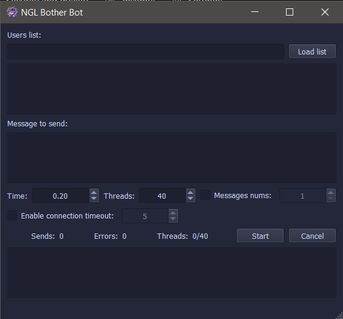

# NglBotherBot

## Overview:
NglBotherBot is a simple tool designed to send repeated NGL messages to specified usernames. It is intended for light-hearted use among friends (If you use this tool, you can text me anything using this name `usamaily` lol xD).

Enter one or more `ngl.link` usernames, type a message, and the application will send it multiple times automatically.

## Disclaimer:
This project is provided for entertainment purposes only.  
The author is not responsible for misuse, including harassment, bullying, or any harmful activity performed with this software.

## Features:
- Supports multiple usernames.
- Custom message input.
- Automated repeated sending.
- Compatible with Python 2 and Python 3.

## Requirements:
- Python
- pip packages:
  - `cloudscraper`
  - `ManyQt`
  - `PyQt5` (or `PyQt4`)
  - `PyInstaller` (or/and `Nuitka`) (optional, for building executables)

## Installation:
1. Install Python.
2. Install dependencies:
   ```bash
   pip install cloudscraper ManyQt PyQt5 PyInstaller
    ```

3. (Optional) Build executable using:

   * `pyinstallerbuilder.py`
   * `nuitkabuilder.py`

## Usage:

Run the application:

```bash
python main.py
```

## Credits:

If you use or modify this project, include proper credit.

## Screenshots:



## Video:

Uploading...
